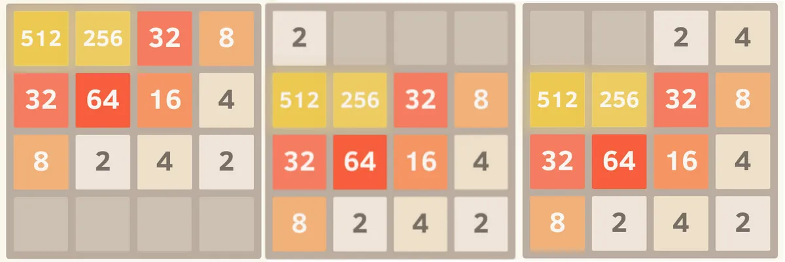

# 3072 GAME

Authors: Matthew Angulo, Gerard Du Pre

The game consists of adding the numbers that are the same until you reach the number 3072, there you can decide whether to continue until you can't make any more moves.

[Original Game](https://play2048.co/)

## How to play

1. To add two numbers you need to join two cells with the same number

2. To move the board you must insert the following characters:

🔼 Up-&gt; W
🔽 Down-&gt; S
⬅️ Left-&gt; A
➡️ Right-&gt; D

3. To win you need to have a cell with the number 3072 🏆

4. If you fill the whole board you will lose the game 😭

## Menus

**Main menu**

1-Play: Select difficulty.

2-Achievements: See your achivements.

3-Exit: Exit program.

**Difficulties submenu**

1-Demon: The board to play is 3x3.

2-Medium: The board to play is 4x4.

3-Easy peasy: The board to play is 5x5.

4-Exit: Go back.

5-Easter egg: This hidden option allows you to start the game with a number from 2 to 5.